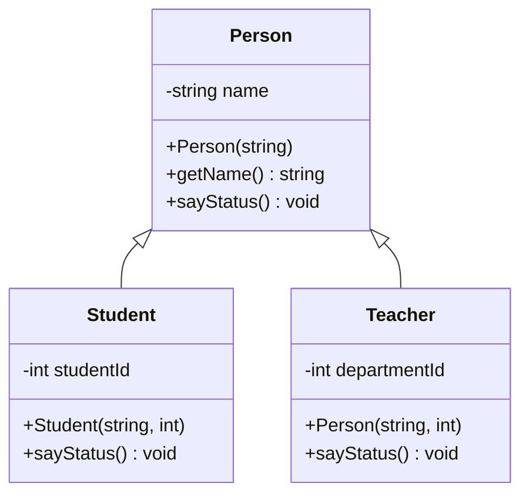

# Tehtävän luokkakaavio

```mermaid
classDiagram
    class Person{
        -string name
        +Person(string)
        +getName() string
        +sayStatus() void
    }
    class Student{
        -int studentId
        +Student(string, int)
        +sayStatus() void
    }
    class Teacher{
        -int departmentId
        +Person(string, int)
        +sayStatus() void
    }
    Person <|-- Student
    Person <|-- Teacher
```