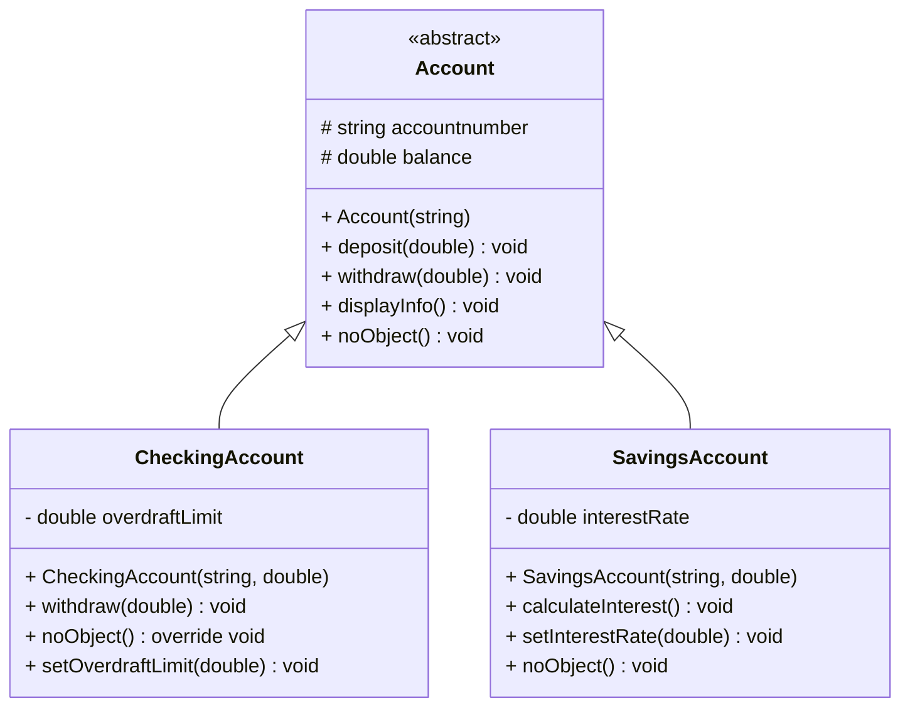

# Pankkitilijärjestelmän luokkakaavio

```mermaid
classDiagram
    class Account{
        <<abstract>>
        # string accountnumber
        # double balance
        + Account(string)
        + deposit(double) void
        + withdraw(double) void
        + displayInfo() void
        + noObject() void
    }
    class CheckingAccount {
        - double overdraftLimit
        + CheckingAccount(string, double)
        + withdraw(double) void
        + noObject() override void
        + setOverdraftLimit(double) void
    }
    class SavingsAccount{
        - double interestRate
        + SavingsAccount(string, double)
        + calculateInterest() void
        + setInterestRate(double) void
        + noObject() void
    }
    Account <|-- CheckingAccount
    Account <|-- SavingsAccount
```