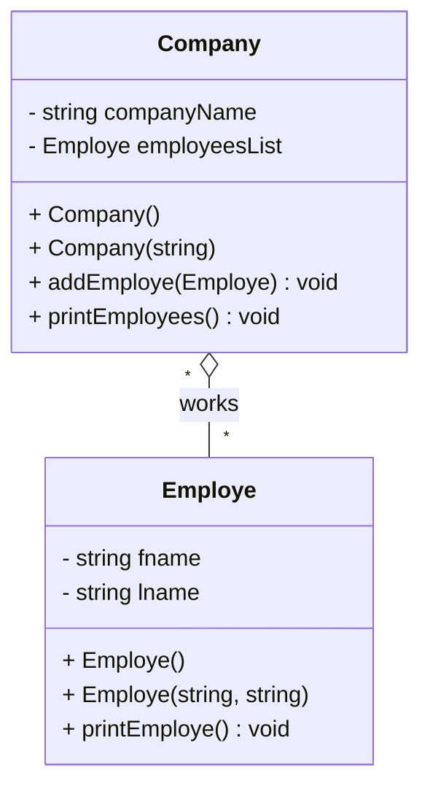

# Aggregaatio esimerkki

## Luokkakaavio

```mermaid
classDiagram
    class Employe{
        - string fname
        - string lname
        + Employe()
        + Employe(string, string)
        + printEmploye() void
    }

    class Company{
        - string companyName
        - Employe employeesList
        + Company()
        + Company(string)
        + addEmploye(Employe) void
        + printEmployees() void
    }

    Company "*" o-- "*" Employe : works

```
