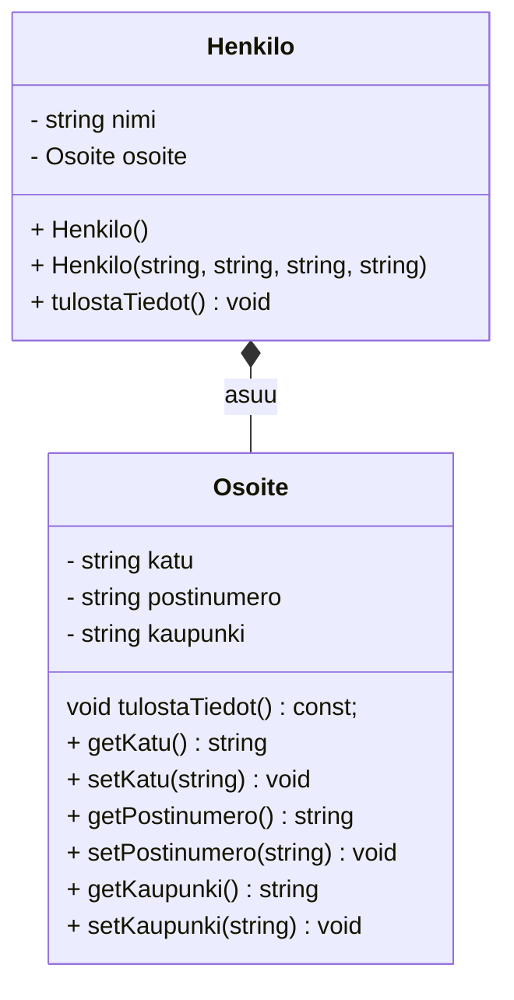

# Kompositio tehtävän luokkadiagrammi

```mermaid
classDiagram
    class Henkilo {
        - string nimi
        - Osoite osoite
        + Henkilo()
        + Henkilo(string, string, string, string)
        + tulostaTiedot() void
    }
    class Osoite {
        - string katu
        - string postinumero
        - string kaupunki
            void tulostaTiedot() const;
        + getKatu() string
        + setKatu(string) void
        + getPostinumero() string
        + setPostinumero(string) void
        + getKaupunki() string
        + setKaupunki(string) void
    }
    Henkilo *-- Osoite : asuu
```