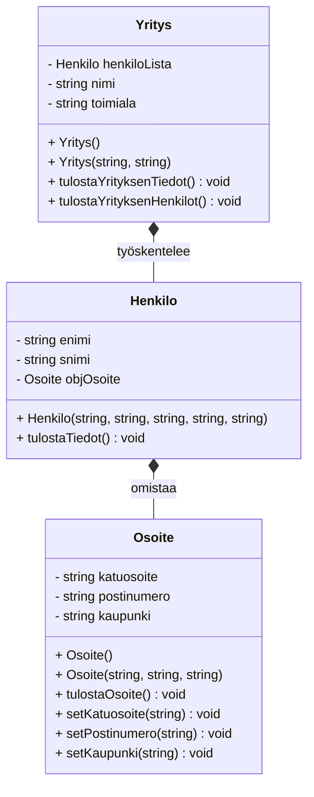

# Luokkakaavio

Tehtävässä on kompositio komposition sisällä.

```mermaid
classDiagram
class Osoite{
    - string katuosoite
    - string postinumero
    - string kaupunki
    + Osoite()
    + Osoite(string, string, string )
    + tulostaOsoite() void
    + setKatuosoite(string) void 
    + setPostinumero(string) void 
    + setKaupunki(string) void 
}
class Henkilo{
    - string enimi
    - string snimi
    - Osoite objOsoite
    + Henkilo(string, string, string, string, string)
    + tulostaTiedot() void
}
class Yritys{
    - Henkilo henkiloLista
    - string nimi
    - string toimiala
    + Yritys()
    + Yritys(string, string)
    + tulostaYrityksenTiedot() void
    + tulostaYrityksenHenkilot() void
}
Yritys *-- Henkilo : työskentelee
Henkilo *-- Osoite: omistaa

```